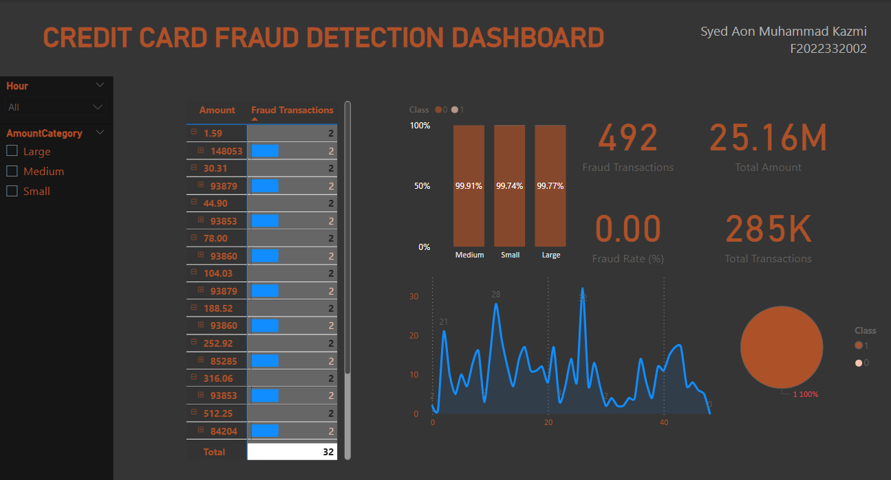

# Credit Card Fraud Detection Dashboard - Power BI

## Introduction
This Power BI dashboard analyzes transaction patterns using the [Credit Card Fraud Detection dataset](https://www.kaggle.com/mlg-ulb/creditcardfraud) to identify fraudulent activity. The project covers the full analytics pipeline from data import to interactive visualization.

## Dataset
- **Source**: Kaggle (284,807 transactions from Sept 2013)
- **Content**:
  - 492 fraudulent transactions (0.17% of total)
  - 28 anonymized features (V1-V28)
  - Transaction time (seconds)
  - Amount (USD)
  - Class label (0=legitimate, 1=fraud)

## Data Processing
1. **Transformations**:
   - Converted time to hourly intervals
   - Categorized amounts: Small (<$10), Medium ($10-100), Large (>$100)
   - Created human-readable labels (Fraud/Legit)

2. **Key Metrics**:
   - Total Transactions: 284,807
   - Fraud Transactions: 492
   - Fraud Rate: 0.17%
   - Total Amount Processed: $25M

## Dashboard Features
- **Overview Page**:
  - Fraud distribution pie chart
  - Amount category analysis
  - Key performance indicators

- **Time Analysis Page**:
  - Hourly fraud frequency
  - Transaction heatmap by hour
  - Top 10 fraudulent transactions

- **Interactivity**:
  - Hour range slicers
  - Amount category filters
  - Dynamic risk scoring

## Key Insights
1. Fraud concentrates on high-value transactions (>$100)
2. Peak fraud activity occurs between 1AM-5AM
3. Average fraud amount ($122) is 38% higher than legitimate transactions
4. Certain PCA features (V3, V4, V7) show strong fraud correlations

## Usage
1. Download the dataset from Kaggle
2. Open `Fraud_Detection_Dashboard.pbix` in Power BI
3. Connect to the dataset
4. Use slicers to explore patterns

[Download Dataset](https://www.kaggle.com/mlg-ulb/creditcardfraud) | 
[View Dashboard](fraud_dashboard.pbix)

---

*Replace dashboard_preview.png and fraud_dashboard.pbix with your actual files*
